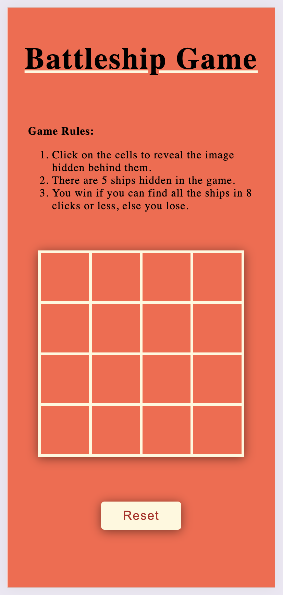
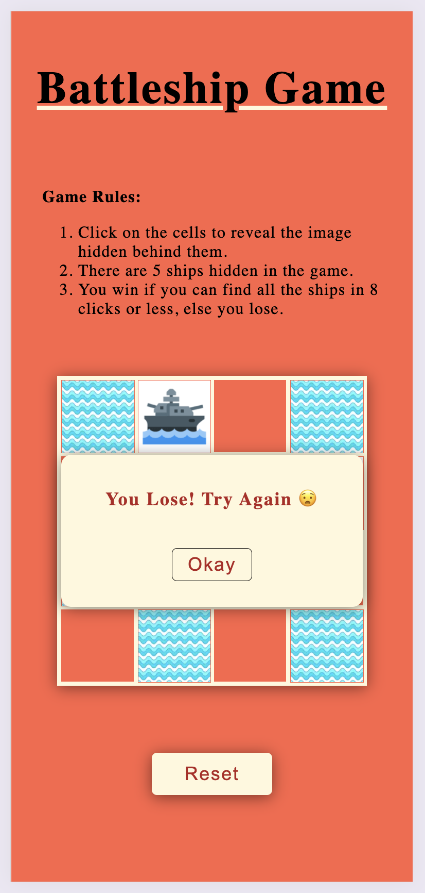
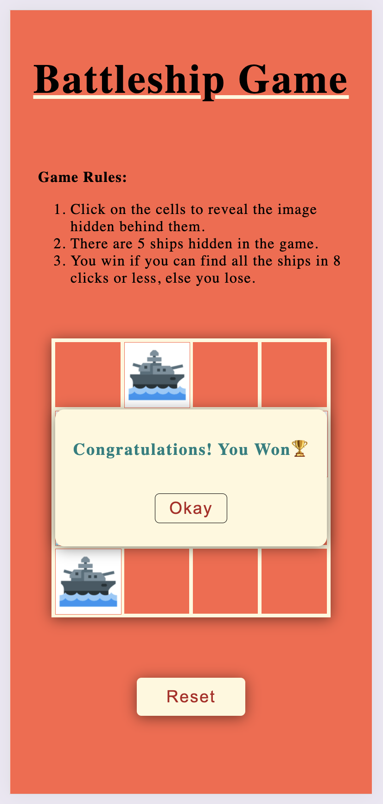
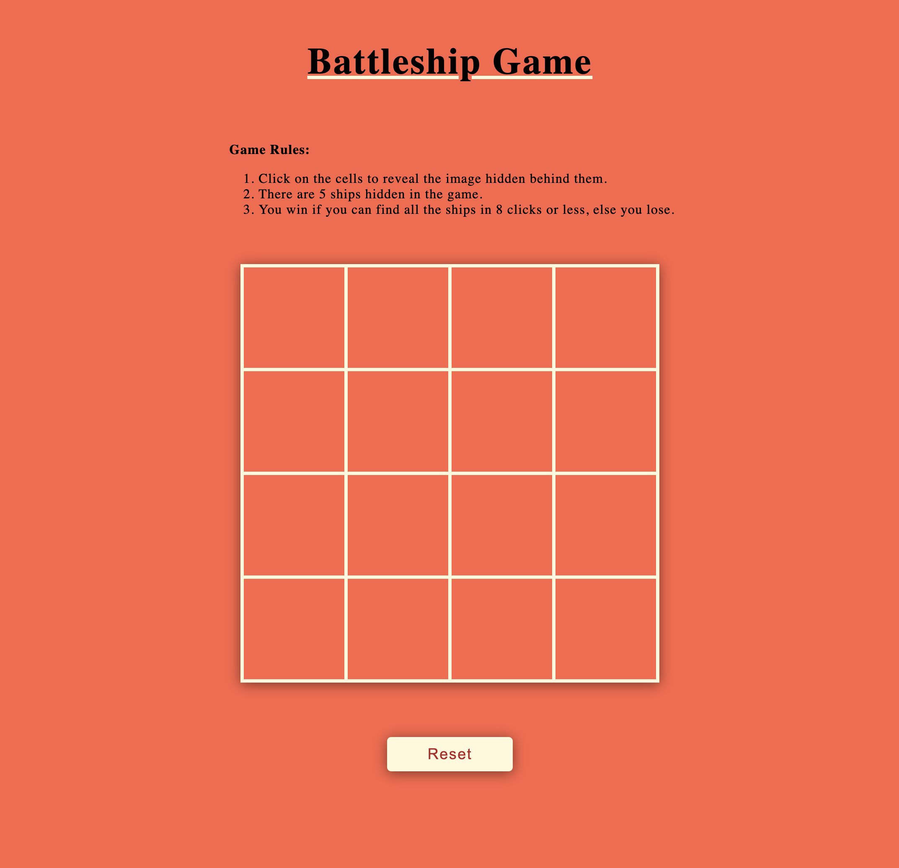
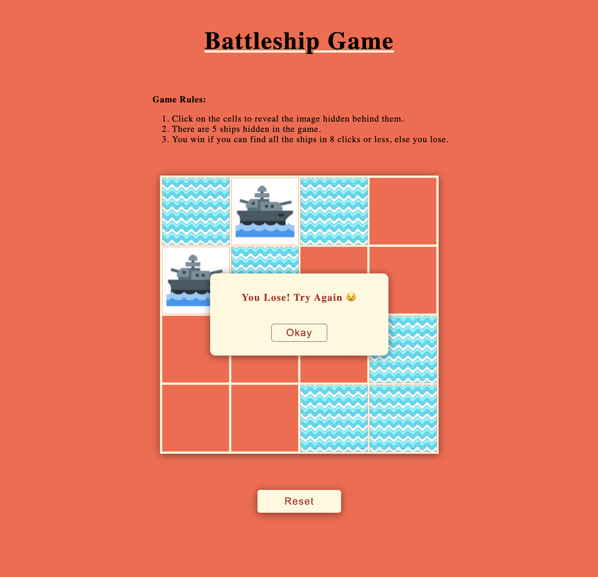

# Battleship Game Project

## Overview

This project is a web-based Battleship game implemented using HTML, CSS, and JavaScript. The game allows users to click on grid items to find hidden ships. The game ends when either all ships are found or the player reaches the maximum number of allowed clicks. The game provides feedback through a dialog box that announces whether the player has won or lost.

### Key Features:
1. User-Friendly: Simple, Intuitive and Interactive grid-based gameplay.
2. Dialog Box: Feedback through dialog boxes.
3. Responsive Design: The application layout is responsive and works well on different screen sizes.

### Game Rules:
- The game consists of a grid with hidden ships.
- Click on the grid items to reveal the hidden ships.
- There are 5 ships hidden in the game.
- You win if you can find all the ships in 8 clicks or less, else you lose.
- A dialog box will display the game result.

## Screenshots
### mobile:

### web:

## How to Run
1. Clone the repository.
2. Open index.html in a web browser.
